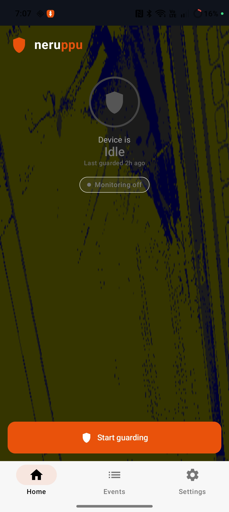
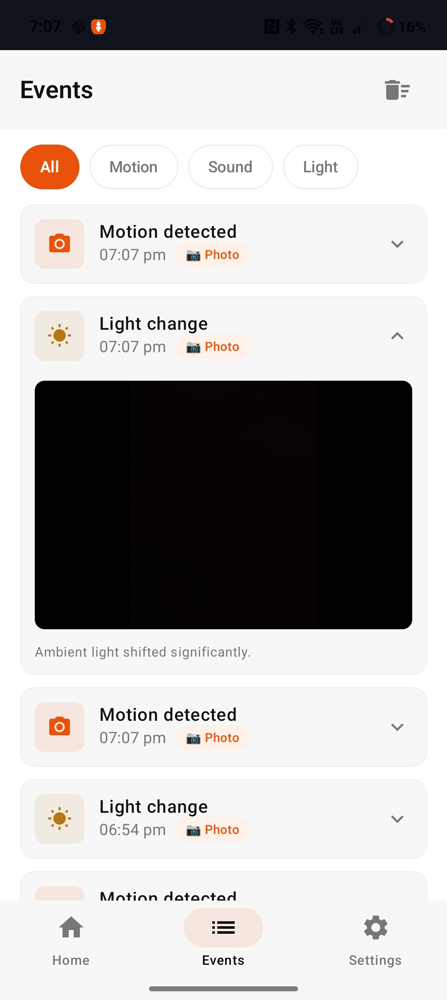
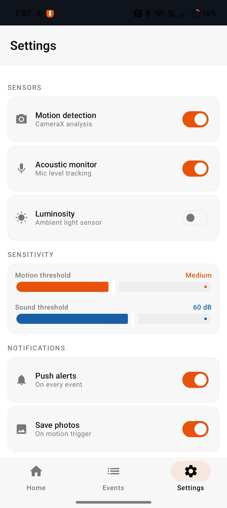

# Neruppu (Physical Security & Monitoring)

Neruppu (Tamil for *Fire*) is a modern, high-security Android application that turns your device into a sophisticated physical monitoring system. Built on the legacy of "Haven," Neruppu is redesigned from scratch using the latest Android technologies to provide an air-gapped, privacy-first security solution.

  

 

## Key Features

*   **Intelligent Guarding**: Monitor your environment using the camera, microphone, and motion sensors simultaneously.
*   **Visual Evidence**: High-speed motion analysis using CameraX captures photos when movement is detected.
*   **Acoustic Bursts**: Real-time microphone tracking automatically records audio clips when sudden noise occurs.
*   **Matrix Alerts**: Receive real-time alerts on any device using the Matrix protocol (configurable in settings).
*   **Privacy First**: Strictly offline-first architecture with encrypted configuration storage.
*   **Smart Storage Management**: Clear your security logs and physically wipe associated media files from storage with a single confirmation.
*   **Unified UI/UX**: A modern, Jetpack Compose interface with a consistent design language across all screens.
*   **Persistent Monitoring**: Robust Foreground Service ensures continuous protection even when the app is in the background.

## Project Structure

The project follows a modular Clean Architecture pattern:
- `:app` - Entry point, Foreground Service, and Hilt DI setup.
- `:domain` - Core business logic, models, and repository interfaces (Pure Kotlin).
- `:data` - Repository implementations, Room database, and hardware drivers (Camera, Sensors).
- `:ui` - Common UI components and feature-specific Jetpack Compose screens.
- `:core` - Shared utilities, theme definitions, and base classes.

## Screen-by-Screen Breakdown

### 1. Home - The Dashboard
The command center. Toggle monitoring with the "Start Guarding" button. View real-time sensor levels (Luminosity, Sound dB, Motion) and a live activity preview.

  

 

### 2. Events - The Evidence Log
Review all security triggers in a unified, modern list.
*   **Filter**: Quickly filter between Motion, Sound, or Light events.
*   **Review**: Expand items to view high-quality photos or listen to captured audio.
*   **Safe Clear**: Delete logs with an optional toggle to physically wipe the media files from your device.

  

 

### 3. Settings - Calibration & Matrix
Fine-tune your security environment.
*   **Sensor Toggles**: Enable/Disable specific sensors.
*   **Sensitivity Sliders**: Adjust motion and sound thresholds to minimize false positives.
*   **Matrix Configuration**: Detailed setup for receiving remote notifications.

  

 

##  Matrix Configuration Guide

To receive alerts on your primary phone or computer:

1.  **Create a Room**: On your Matrix client (e.g., Element), create a new private room.
2.  **Get Credentials**:
    *   **Homeserver URL**: e.g., `https://matrix.org`.
    *   **Room ID**: Found in Room Settings -> Advanced (looks like `!abc123:matrix.org`).
    *   **Access Token**: Found in your User Settings -> Help & About (Advanced).
3.  **Configure**: Enter details in Neruppu Settings and tap **Save Config**.
4.  **Verify**: Use the **Test Connection** button to confirm setup.

## 📥 How to Try Neruppu
You can try Neruppu immediately by downloading the latest `.apk` from the **Releases** tab.

Simply install the app on your Android device and start guarding your environment. We highly value your feedback—whether it's constructive criticism or appreciation, your input is vital to making Neruppu a better tool for everyone.
