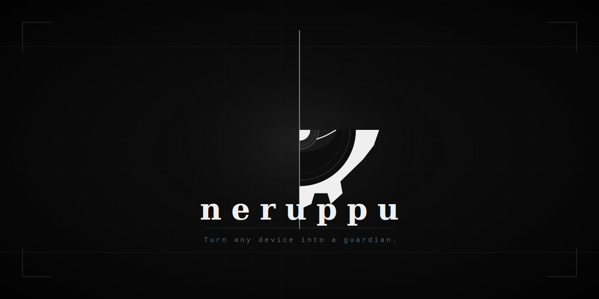

# Neruppu - Turn any android device into a guardian.

Neruppu is a comprehensive Android security application designed to turn your device into a smart monitoring station. Using a variety of on-device sensors, Neruppu detects environmental changes and records events with media evidence.

<!-- 

  

 -->

## Features

- **Motion Detection**: Advanced motion analysis using CameraX and physical displacement tracking via Accelerometer.
- **Acoustic Monitoring**: Real-time microphone level tracking with automatic audio recording when sudden noise occurs.
- **Luminosity Tracking**: Detects changes in ambient light levels.
- **Persistent Monitoring**: Runs as a robust Foreground Service to ensure continuous protection even when the app is in the background.
- **Event Logging**: Detailed history of all security events, including timestamps, sensor types, and captured media (photos/audio).
- **Adaptive Sensitivity**: User-configurable thresholds for motion and sound to minimize false positives.
- **Real-time Dashboard**: Live visualization of sensor data and system status built with Jetpack Compose.

## Project Structure

The project follows a modular Clean Architecture pattern:
- `:app` - Entry point, Foreground Service, and Dependency Injection setup.
- `:domain` - Core business logic, models, and repository interfaces (Pure Kotlin).
- `:data` - Repository implementations, Room database, and hardware drivers (Camera, Sensors).
- `:ui` - Common UI components and feature-specific Compose screens.
- `:core` - Shared utilities, theme definitions, and base classes.

## 📥 How to Try Neruppu
You can try Neruppu immediately by downloading the latest `.apk` from the **Releases** tab.

Simply install the app on your Android device and start guarding your environment. We highly value your feedback—whether it's constructive criticism or appreciation, your input is vital to making Neruppu a better tool for everyone.
